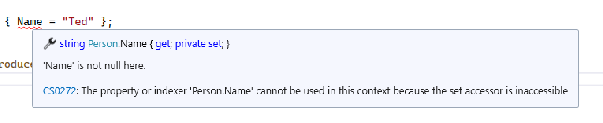
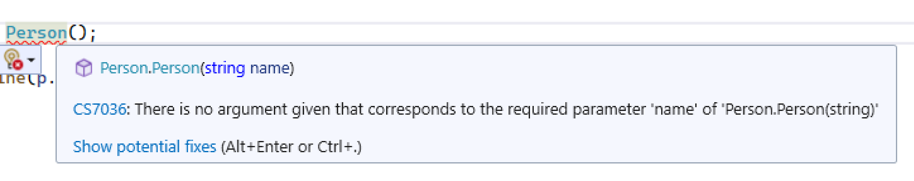
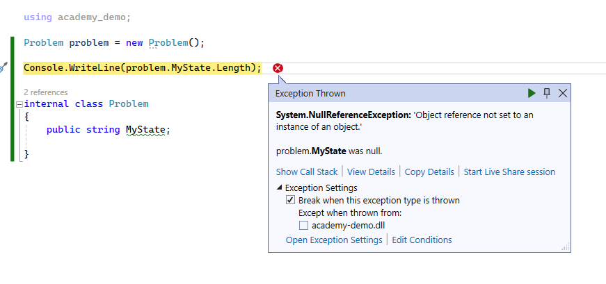

# Constructors

Okay, we promised we'd get round to explaining it a bit more, so here we go.

We currently have two properties in our Person class:

```c#
public string Name { get; set; }
public int Age {get; set; }
```

Both of these are public and means that *anyone* can access and change the values in them at any time.

Why is this a problem? Well consider this problem. We have created an instance of Person called "Bob". Now "Bob" has a name and an age.

We've provided ways for the name and age to be updated via some very nice methods for external users. We might even have extra code in them that means it checks whether the person calling the method has the permissions to update the name or age, and logs who made the request to the system so we have an audit trail.

However, if we allow external users to *directly* use the public `set`, then they can bypass all our code that checks things are done correctly, they have permissions, and that the change is logged. Uh-oh, things were changed and we have no evidence the person was allowed to do it, who did it, but "Bob" is now very angry everyone keeps calling them "Andy".

## Private set

Let's update our Person class to have a private set:

```c#
public string Name { get; private set; }
public int Age {get; private set; }
```
Excellent, problem solved! Now only the object (the *instance* of the class) can update itself!

But if we check over at our Program.cs file, we'll see problems!



Oh. So let's remove that so we just instantiate Person:

```c#
Person p = new Person();
p.updateName("Ted");
```

Great! Now it all works fine.

### One small problem...

That's all great, our method works fine, but we *have* to call the method to set a name. What happens if we *don't* call the `updateName` method, or even know it exists, or that we are supposed to call it before using it?

Well, then we end up with an object that isn't ready to use in its default state.

This code for instance:

```c#
Person p = new Person();

Console.WriteLine(p.introduce());
```

results in this output:


Ah. That's a bit of a problem.

If we always want our object to have a Name and Age set, we do that by using a constructor than means the class cannot be instantiated or the object created without certain conditions being met.

## The Default Constructor

We covered very briefly earlier about the default constructor and how C# does some magic fo you if you don't declare one in your class. Consider the following code:

```c#

public class Dog
{

}

```

We can construct this - or instantiate this - without any further code as an object:

```cs
Dog d = new Dog();
```

That's it, the object is ready to use. The magic C# is doing is creating a default constructor if you *haven't* declared one.

The default constructor that C# creates for you if you have NOT declared one is like this:

```cs
public Dog() {}
```

This is a parameterless constructor - that is, there are no parameters in the parenthesis `()`. Between the curly braces `{}` is where any code would be written.

So a constructor is a bit like a method that is *automatically* called when you instantiate the class to an object using the `new` keyword.

> NOTE There are ways in Go to create constructors and use a function known as `init`, but we are not going to cover that here.

You'll note the signature  ```Dog()``` in the constructor is exactly what we call to instantiate the object: ```Dog d = new Dog();```.

Now, if you add the code 

```cs
public Dog() {}
```

to your class, that becomes the *default* constructor. A default constructor is one that takes *zero* parameters.

### Setting values in the constructor

Now, we *could* get our our Person problem (having to call a method to set the Name before the object is ready) by using code in our constructor:

```cs
public Person() {
    Name = "Ted";
}
```

Now, if we ran our code we would at least get a name printed out:


**BUT** what if the person's name *wasn't* Ted, but Bob. Or Bill, or Sue, or Jane or anything else? Well, they would always be called Ted *unless* we called the method. 

Hmm. That doesn't sound good. We want to make sure the name and age are *always* set before the object can be used. How do we enforce that so our calling code knows we need these things when we are creating it?

## Classes Without Default Constructor

You can create a class with your own constructor, that takes 1 or more parameters to guarantee the object is setup and ready to go before anyone uses it.

Let's look at a simple example - we want to make the calling code give us a name before we agree to build our object. To do this we need to alter our constructor:

```cs
public Person(string name) {
    Name = name;
}
```

Not a big change here. We have added the parameter `name` of type `string`, and added some code to set the `Name` property to whatever is in the `name` variable parameter.

> Wait! How come we can set the `Name` property? I thought it was private? Yes - and it still is - the *class* is accessing it, not the external calling code. The class itself has access to *everything* else inside it, the external calling code only has access to the public methods and public properties.

If you now switch back to Program.cs you'll notice that lovely red squiggle under the ```People()``` call, with some odd error if you hover over it:



No argument given that corresponds to the required parameter 'name' of Person.Person(string)? What?

Our constructor operates the same way as a function or method - if it has parameters, you MUST supply them.[^1]

SO let's update our code to provide that string parameter:

```c#
Person p = new Person("Dave");
```

Now there are no more squiggly lines, we can run our code again and see that it outputs the greeting!

## Why is this important?

Unlike in Go, C#'s primitive types don't have default values in quite the same way, so you can end up with null reference errors. We don't have quite the same problem in a class with properties, but let's take some more code to show you the problem.

Let's assume I have a field (not a property) in a class called MyState that is of type string, and I have never set a value for it.

```c#
Problem problem = new Problem();

Console.WriteLine(problem.MyState.Length);

internal class Problem
{
    public string MyState;

}
```

 When I try and find out the length of the string in code, I get a horrible error:



The good news, however, it that you will see this error a lot and get used to it. The bad news is that you will see this error a lot and get used to it.

To avoid problems like this we can used our constructor technique to pass the initial state as a parameter and set that in our constructor:

```c#
Problem problem = new Problem("Solved!");

Console.WriteLine(problem.MyState.Length);

internal class Problem
{
    public string MyState;

    public Problem(string initialState)
    {
        MyState = initialState;
    }

}
```

## Lab

1. Add a new parameter `age` to the constructor of type `int`.
2. Update the constructor code to set the `Age` property
3. Make sure your code works!


[^1]: ok, this isn't completely true, but it's true enough for now.