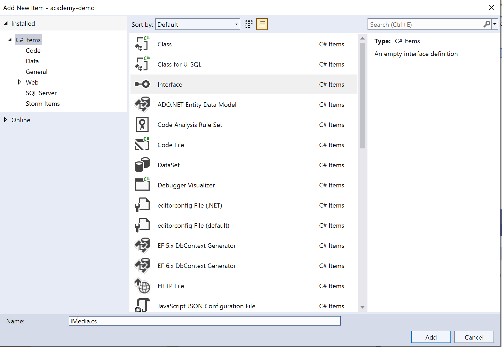
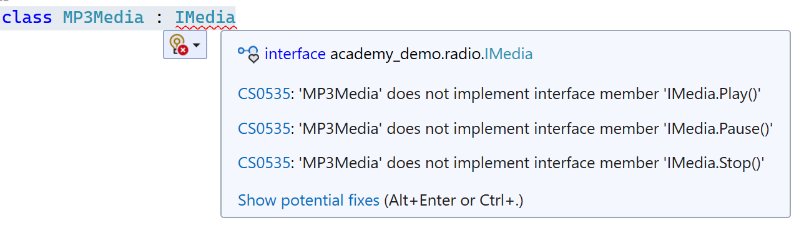
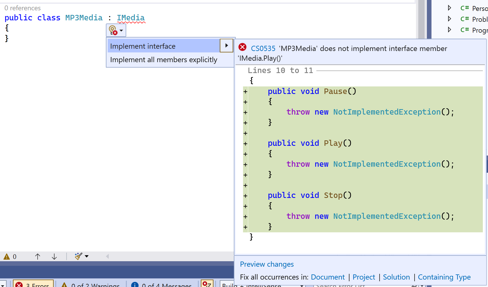
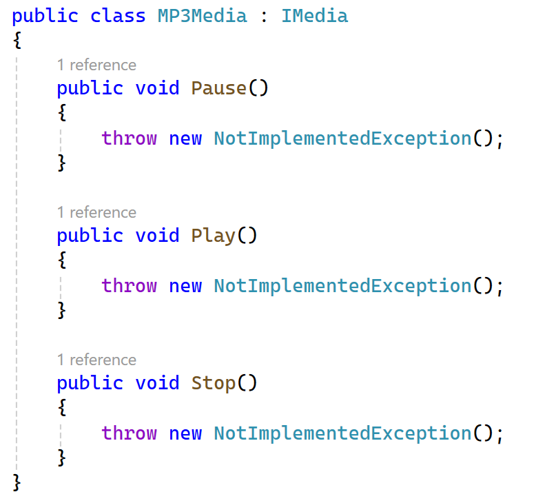
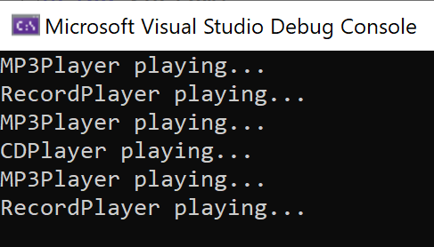

# Interfaces

Okay, so this is going to be a bit of a leap now, We're going to look at some of the advantages of Object Oriented Programming (OOP) in particular the use of interfaces.

Trying to describe interfaces generally ends up being a talk about *abstraction*, *polymorphism*, or *decoupling*.

We shall now attempt the impossible and try to give examples without using any of those words.

> NOTE: We use C# conditional logic, lists, and loops in this chapter that are explained in [the next chapter](/part5/chapter05.md). You can either look at it now, or whever you want.

## What's the problem?

Let's imagine we have a different types of media - CD, MP3, and Record. They all need different devices to play them.

When we write this is code, we could create three separate classes:

```c#

public class CDMedia(){
    public void Play(){
        Console.WriteLine("CDPlayer playing...")
    }
}

public class MP3Media(){
    public void Play(){
        Console.WriteLine("MP3Player playing...")
    }
}

public class RecordMedia(){
    public void Play(){
        Console.WriteLine("RecordPlayer playing...")
    }
}

```
Okay, not too bad. We can see some repetition and spot a pattern, but for now that's fine.

Now, imagine we are a mythical radio station - **Academy FM** - that plays new music sent to us in one of those media formats.

When we receive the media, we have to choose what player we need, and press play.

In code, that might look something like this:

```c#
if (mediaType == "CD") {
    CDMedia player = new CDMedia();
    player.Play();
}

if (mediaType == "MP3") {
    MP3Media player = new MP3Media();
    player.Play();
}

if (mediaType == "Record") {
    RecordMedia player = new RecordMedia();
    player.Play();
}

```

And this is fine. It works, and the code's pretty clean and understandable. 

Now we want to have a scheduler of when to play these songs overnight when we are in bed, so our nighttime listeners can have some company.

So we want to create a list, or collection of all the songs we want to play, which are all on different media, and then set it off before we leave for the night. Sounds easy right? We just create a list of all the media we want to play and loop round it pressing `Play()` each time, surely?

Wait - how do we have mixed data types in a list? We've got MP3s, Records and CDs. They all have the same `Play()` method, but how do we access it?

So we might have a list of song on media like this:

```
Your Song (Record)
Bad Habits (MP3)
Running Up That Hill (CD)
Peggy Sue (Record)

...and many more
```

But they are all different data types, even though they have the same named methods. We can't, for instance, do this in code:

```c#
List<Record> toBePlayed = new List<>(); //create a List of type Record
toBePlayed.Add(new RecordMedia()); //ok, add a record to the List
toBePlayed.Add(new MP3Media()); //won't work - MP3Media is not the same type as needed by the list!
```

> You cannot mix data types in a list like this. 

But we have the same method we want in all of them. It shouldn't be this hard? Maybe I can pass three lists in each of the right type and do some randomisation of the playlist? Maybe I could provide the list as a list of strings, and do some looping round?

Well, I guess you could, but there is a far easier way: using an interface.

## What's an interface then?

An interface is a contract. It states that all things that use (*implement*) that interface are **guaranteed** to have exactly the methods and properties defined in the interface. <ins>But the interface itself contains no executable code.</ins>

That means that if we have an interface that says *"everything that uses (implements) me MUST have the method Play() available"* then that is a contract or guarantee that the Play() method WILL be available.

When a class uses and interface, we say it *implements* that interface. Any class that *implements* an interface, must, by definition, also implement all the methods and properties defined in the interface.

Enough talk, let's see what an interface might look like:

```c#
interface IMedia
{
    void Play();
    void Pause();
    void Stop();
}
```

Okay, so to define an interface we use the keyword `interface`, then the name we want it to have (by convention in C#, interface names are preceded with a capital I).

Then we have our methods that every implementing class MUST have in order to correctly agree the contract.

And to implement an interface in a class:

```c#
class MP3Media : IMedia
{
    public void Play()
    {
        Console.WriteLine("MP3Player is playing.");
    }

    public void Pause()
    {
        Console.WriteLine("MP3Player is paused.");
    }

    public void Stop()
    {
        Console.WriteLine("MP3Player is stopped.");
    }
}
```

> The C# shorthand for "this class implements this interface" is the colon `:`. So in the above the line `class MP3Media : IMedia` is saying "The class MP3Media implements the interface IMedia".

Let's now assume all our classes implement this interface. We can now do something very magical. We can create a List that accepts all the classes that implement that interface:

```c#

    List<IMedia> toBePlayed = new List<IMedia>();
    toBePlayed.Add(new MP3Media());
    toBePlayed.Add(new CDMedia());
    toBePlayed.Add(new RecordMedia());

```

And because we *know* each of those concrete instances MUST implement *all* of the methods in the interface, we can iterate over that list and for each item access its Play() method, *even though each method outputs different results and we don't know **exactly** what type of media we are playing*:

```c#
    foreach (IMedia media in toBePlayed) {
        media.Play(); 
    }
```

> If you are currently sat, knees hugged to your chest, wondering what all that was about, let's do some actual coding. I hope it helps.

## Let's create our own interface

1. Create a new folder in your project. You can do this by right clicking on *academy-demo* in the Solution Explorer on the left hand side like you did before and selecting `Add > New Folder` from the menu. Call the folder `radio`.

2. Right click on the `radio` folder and select `Add > Class...` from the menu. Select "Interface" from the list in the middle, and call the class `IMedia.cs`, and click Add.



3. Put the following code in the file, replacing the code block that starts with `internal interface IMedia`:

```c#
interface IMedia
{
    void Play();
    void Pause();
    void Stop();
}
```

Okay, so we have an interface. Hurrah. Let's create a class that implements that interface.

4. Right click on the `radio` folder and select `Add > Class...` from the menu. Call the class `MP3Media.cs` and click Add.

5. Update the line ```internal class MP3Media``` to be:

```c#
public class MP3Media : IMedia
```

At this point, we'll see our friend the squiggly red line:



`MP3Media does not implement interface member 'IMediaPlay()'`? What's that about?

This is that interface contract we talked about. When you implement an interface, you MUST implement all its methods.

Fortunately, the IDE is able to help us. Click on the link `Show potential fixes`:



Click on the `implement interface` menu item:



Ta-da! The IDE has implemented the interface contract for you!

> There's some code we haven't seen before - `throw new NotImplementedException();`. This is a *bit* like Go errors. For the moment, we are going to replace the code and not worry about it. We'll cover exceptions later on.

6. Okay, so now we need to update our code in our `MP3Media` class. In the Play() method, change it to be:

```c#
Console.WriteLine("MP3Player playing...");
```
7. Go back to your Program.cs file. Remove all the previous code and replace it with:

```c#
using academy_demo.radio;

MP3Media mp3 = new MP3Media();
mp3.Play();
```

Run the code (F5) and see what is printed out!

8. Okay, now go back to your radio folder and create two new classes `CDMedia` and `RecordMedia`, both of which implement `IMedia`.

9. Update both RecordMedia and CDMedia's `Play()` method to print to the console the type of player being used (RecordPlayer or CDPlayer).

10. Let's switch back to `Program.cs` and create a List we will iterate through:

```c#
using academy_demo.radio;

List<IMedia> playList = new List<IMedia>();
playList.Add(new MP3Media());
playList.Add(new RecordMedia());
playList.Add(new MP3Media());
playList.Add(new CDMedia());
playList.Add(new MP3Media());
playList.Add(new RecordMedia());

foreach (IMedia media in playList)
{
    media.Play();   
}
```
11. Let's run out code (F5), and you should see:



***

## Lab

An old media format has come back into fashion, the humble [cassette tape](https://en.wikipedia.org/wiki/Cassette_tape).

Create a class for the new media that implements the interface, and add it to our playlist!

***

[Chapter 5 >>](/part5/chapter05.md)