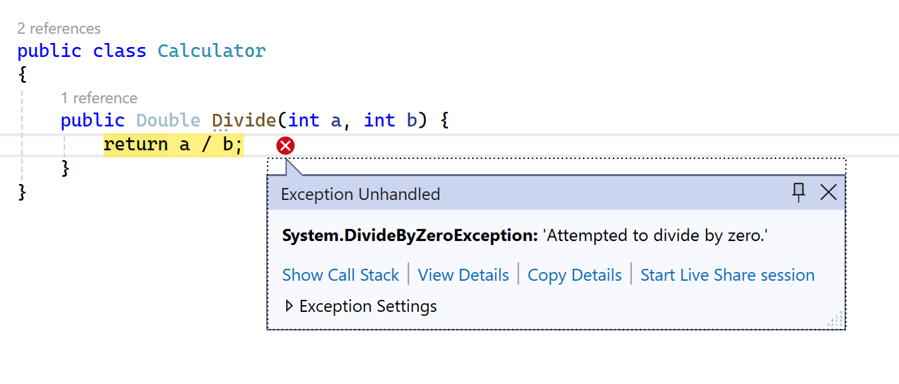
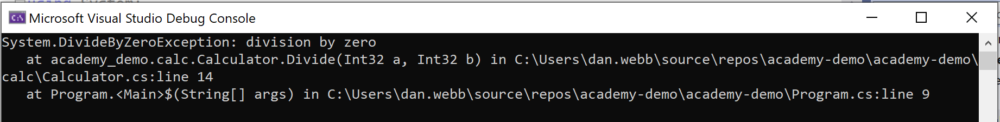

# Exceptions

Exceptions in C# are *roughly* analogous to errors in Go, however with quite a lot of differences in how they are used and caught.

In Go, for instance, we could create a function that divides two numbers, and returns an error if we attempt to divide by zero:

```go
func divide(a int, b int) (int, error) {
    if b == 0 {
        return 0, errors.New("division by zero")
    }
    return a / b, nil
}
```

So if our second parameter is 0, we will return an error from the function along with out dummy value of 0 to fullfil both return types (int and error).

We'd handle this error like so:

```c#
    result, err := divide(10, 0)
    if err != nil {
        fmt.Println("Error:", err)
    }
```

So in Go, errors are handled by using conditional checks of the returned values from the function.

In C# it's a *tiny* bit different. And because this is about classes rather than C# itself, let's create our own Calculator class.

1. Create a new folder under the **academy-demo** project called `calc`
2. Create a new class called `Calculator` in the `calc` folder
3. Add the following code:

```c#
public class Calculator
{
    public Double Divide(int a, int b) {  
        return a / b; 
    }
}
```

4. Back in your Program.cs file, remove the existing code and change it to be:

```c#
using academy_demo.calc;

Calculator calculator = new Calculator();
Double result = calculator.Divide(10, 0);
```

5. Run the code and be horrified that this happens in the IDE:



> This is known as an "unhandled exception". You can see the reason for the exception 'Attempted to divide by zero'.

Okay, so how do we handle this in C#?

## Handling Exceptions

In C# there's the concept of a `try...catch` block that handles exceptions. You can think of it a *bit* like the conditional code you have to write in Go, except it look very different:

```c#
try {
    //some code that *might* throw an exception
}
catch (Exception ex){
    //do something because there has been an error
}
```

## Update our code

Let's have a look at some updated code to call our calculator:

```c#
Calculator calculator = new Calculator();

try
{
    Double result = calculator.Divide(10, 0);
    Console.WriteLine(result);
}
catch (Exception ex)
{
    Console.WriteLine(ex.ToString());
}
```

> If you'd prefer a plain English example, we'll try and explain here. The code above says "within the code contained in this `try` block, if the code throws an exception, the `catch` it in this other code block, and handle it there."

Now if you run the code, the exception is *caught* and *handled* in the `catch` code block.

## Alternatives

Now this isn't always the best way to handle errors. You Divide() function should probably handle divide by zero and throw a specific error that provides better information.

### Specific exception

You can handle the code in the Divide() function by checking if b is zero and returning a very specific exception:

```c#
public Double Divide(int a, int b) {
    if (b == 0)
    {
        throw new DivideByZeroException("division by zero");
    }
    return a / b;
}
```

Now if you run the code you will get an error with your specific error message:



This is better, as you are not relying on the underlying system messages, so you can make it clearer to the calling code what exactly went wrong. Very useful!

### Chaining

You can also chain you catch blocks, so we can handle specific exceptions and general exceptions:

```c#
public Double Divide(int a, int b) {
    try
    {
        return a / b;
    }
    catch (DivideByZeroException)
    {
        throw;
    }
    catch (Exception)
    {
        //log the non-divide by zero exception problem!
        throw;
    }
}
```

In this example, the Divide has two catch code blocks:
- the first handles the very specific error of division by zero and "re-throws" the exception it caught to the calling code
- the second handles all other error conditions that might happen that are NOT a divide by zero error, and "re-throws" that exception to the calling code

> Where you can, be specific with your exceptions and code for them. Where you cannot, be general and log the error and re-throw the original exception. For now, anyway...

## Swallowing exceptions :( 
There's also a **bad practice** (*well, most of the time*), known as "*swallowing the exception*". This is when the method does handles the exception internally, but never throws an exception, and instead either 
- silently fails (a method with no return type, no exception thrown)
- returns a dummy value and no exception is thrown

Here's an example of the Divide() function swallowing the exception and returning a dummy value of zero:


```c#
public Double Divide(int a, int b) {
    try
    {
        return a / b;
    }
    catch (DivideByZeroException ex)
    {
        return 0;
    }
}
```

Whilst this can *sometimes* be the right thing to do, and we could internally log the error somewhere, for now let's try and surface our errors to the calling code.

## Lab

Update your `Program.cs`:

```c#
using academy_demo.radio;

List<IMedia> playList = new List<IMedia>();

playList.Add(new MP3Media());
playList.Add(new RecordMedia());
playList.Add(new CDMedia());
playList.Add(new MP3Media());

foreach  (IMedia media in playList)
{
    media.Play();
    media.Stop();
}
```

1. When you run the code, it will throw an exception in the IDE. Update the code **only** in this file to handle the exception and print out to the console *"There was an error stopping the media from playing."*

2. Implement the code in *all* your concrete classes (classes that implement the interface) so that the Stop() method no longer throws an exception.

> NOTE: If you have already removed the ```throw new NotImplementedException(); ``` from the codebase and implemented the features, well done! You should still add a exception handling into your loop but you can skip Step 2

***

[Chapter 7 >>](/part7/chapter07.md)
