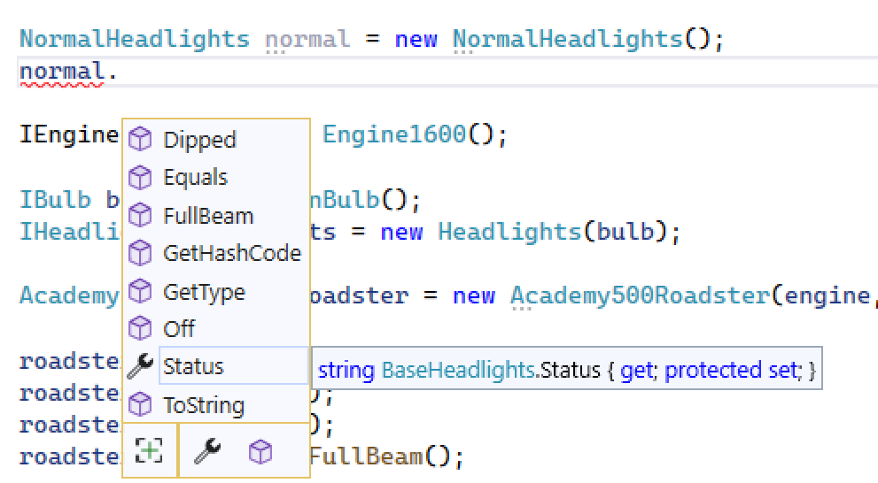

# Composition vs Inheritance

For the previous lab with the headlights, you *probably* did something like this:

1. Defined an interface

```c#
public interface IHeadlights
{
    public string Status { get; }

    public void Dipped();
    public void Off();
    public void FullBeam();

}
```

2. Implemented it in a class for Normal headlights
```c#
public class Normal : IHeadlights
{
    public string Status { get; private set; } = "Off";

    public void Dipped()
    {
        Status = "Dipped";
    }

    public void FullBeam()
    {
        Status = "Full Beam";
    }

    public void Off()
    {
        Status = "Off";
    }
}
```

3. Implemented it in a class for Neon headlights
```c#
public class Neon : IHeadlights
{
    public string Status { get; private set; } = "Off";

    public void Dipped()
    {
        Status = "Dipped";
    }

    public void FullBeam()
    {
        Status = "Full Beam";
    }

    public void Off()
    {
        Status = "Off";
    }
}
```

And then updated your `ICar` and updated your `Academy500Roadster` class to something like:

```c#
//..code
public IHeadlights Headlights { get; private set; }

public Academy500Roadster(IEngine engine, IHeadlights headlights)
{
    Engine = engine;
    Headlights = headlights;
}
//..code
```

Look at the Normal and Neon classes. Hmm, that's a lot of code that does exactly the same thing we've had to write twice - and would have to write again for each and every new type of headlight. Imagine for instance there was a new Halogen headlight and we had to write a new class for that and copy the code. 

However, we do now have more information and we can start to think about the problem differently. It appears it's the *bulb* in the headlight that is the difference.

Of course you fix this by using composition now, so let's do that.

1. Create a new interface class, `IBulb`

```c#
public interface IBulb
{
    string Name { get; }
    int Lumens { get; }
}
```

2. Create a new `NeonBulb` class with readonly properties:
```c#
    public class NeonBulb : IBulb
    {
        public string Name => "Neon";

        public int Lumens => 10000;
    }
```

3. Update `IHeadlights`:
```c#
 public interface IHeadlights
 {
     public string Status { get; }
     public IBulb Bulb {get;}

     public void Dipped();
     public void Off();
     public void FullBeam();

 }
```

4. Create a new `Headlights` class:

```c#
public class Headlights : IHeadlights
{
    public string Status { get; private set; } = "Off";

    public IBulb Bulb { get; private set; }

    public Headlights(IBulb bulb) {
        Bulb = bulb;
    }

    public void Dipped()
    {
        Status = "Dipped";
    }

    public void FullBeam()
    {
        Status = "Full Beam";
    }

    public void Off()
    {
        Status = "Off";
    }
}
```

5. And update our `Program.cs` to use it:

```c#
IEngine engine = new Engine1600();

IBulb bulb = new NeonBulb();
IHeadlights headlights = new Headlights(bulb);

Academy500Roadster roadster = new Academy500Roadster(engine, headlights);
```

We have decomposed the problem and solved it using composition. Now we only need classes for the new bulb types, and they have unique data (`Name`, `Lumens` (or brightness)). No more repeated code!

## Base Classes

Another way this can be solved - and you'll see many examples of this online - is to use what's known as an *abstract base class*.

In fact, if you typed the problem into ChatGPT it would suggest this first. One of the rules we want you to follow is:
> PREFER COMPOSITION OVER INHERITANCE

And we'll show you what we mean by *inheritance* by using the abstract base class.

### Our first base class

Create a new class, called `BaseHeadlights`:

```c#
public abstract class BaseHeadlights
{
    public string Status { get; protected set; } = "Off";

    public virtual void Dipped()
    {
        Status = "Dipped";
    }

    public virtual void FullBeam()
    {
        Status = "Full Beam";
    }

    public virtual void Off()
    {
        Status = "Off";
    }
}
```

This only real new thing we see here is the addition of the word *abstract* and the use of *virtual*. You'll notice that unlike the interface, we **can** include computational code in our abstract class.

> The use of virtual means the method can be overridden. We'll cover this later.

#### What does abstract mean?

In simple terms, marking something abstract is a bit like creating an interface. We cannot directly instantiate a interface, and marking a class as abstract means we cannot directly create a new object from it.

For example, you cannot do:

```c#
BaseHeadlights headlights = new BaseHeadlights();
```

And the compiler won't allow it. You have to have another class that *extends*, or *inherits*, the base class.

#### Extending a base class

Create a new class - `NormalHeadlights`:

```c#
public class NormalHeadlights : BaseHeadlights
{
}
```

The first thing you will notice is that `BaseHeadlights` doesn't get the squiggle underneath telling us we haven't implemented anything from it. Odd. Why is that?

Well, it's because we are utilising inheritance - our class `NormalHeadlights` has *inherited* all the code and properties from its base class.

Our class `NormalHeadlights` contains no code at all. Head over to your Program.cs file and create a new instance of `NormalHeadlights` called `normal`:



You'll notice that when we use the dot notation, all the methods of the base class are shown in the drop down. But NormalHeadlights doesn't contain any code! How is this possible.

Again, inheritance. *All the code* - properties, fields, methods - are available to our *child* or *derived* class (`NormalHeadlights`). This is also known as `subclassing`.

Our base class is known as the `parent class`, or the `super class` in other languages.

#### Swappable

In our previous example, we used the concrete instance of `NormalHeadlights` when instantiation the object. We can also use the base class as the type, like we do an interface to make components *swappable*.

In your `Program.cs` file, let's create our headlights using that:

```c#
BaseHeadlights headlights = new NormalHeadlights();
```

And make the changes to the `Academy500Roadster` class:

```c#
public BaseHeadlights Headlights { get; private set; }

IHeadlights ICar.Headlights => throw new NotImplementedException(); //we need this to satisfy our interface

//..other code

public Academy500Roadster(IEngine engine, BaseHeadlights headlights)
{
    Engine = engine;
    Headlights = headlights;
}

//..rest of the code
```

Now run your code!

## Lab

Create a new class NeonHeadlights that inherits from BaseHeadlights. In your Program.cs file, create a new instance of NeonHeadlights and put them in a new car instance with an engine. Make sure it works!

## Overriding methods

We mentioned earlier that the use of the word `virtual` meant that our methods can be overridden. This means we can have a method in our derived class with the **same name and method signature** as the base class that provides **entirely different functionality**.

> You don't need to use the virtual keyword if you are never going to override the methods.

Open up your NeonHeadlights class and update it:

```c#
public class NeonHeadlights : BaseHeadlights
{
    public override void FullBeam()
    {
        base.Status = "Dazzling Full Beam";
    }
}
```

We have overridden the base class' implementation of the FullBeam() method. Now, when we have a NeonHeadlights instance, it will call this code rather than the code in the base class method:

```c#
using academy_demo.cars;

BaseHeadlights headlights = new NormalHeadlights();
IEngine engine = new Engine1600();

Academy500Roadster roadster = new Academy500Roadster(engine, headlights);

roadster.Accelerate();
roadster.Accelerate();
roadster.Accelerate();
roadster.Headlights.FullBeam();

Console.WriteLine("The car is going " + roadster.Speed + "mph and the headlights are " + roadster.Headlights.Status);

//let's replace our instances
headlights = new NeonHeadlights();
roadster = new Academy500Roadster(engine, headlights);

roadster.Accelerate();
roadster.Accelerate();
roadster.Accelerate();
roadster.Headlights.FullBeam();

Console.WriteLine("The car is going " + roadster.Speed + "mph and the headlights are " + roadster.Headlights.Status);
```

Will output:

```
The car is going 3mph and the headlights are Full Beam
The car is going 3mph and the headlights are Dazzling Full Beam
```

So we can alter our code to suit specific differences between our derived classes.

## This is nearly always bad!

So we've explained abstract base classes, and inheritance. Whilst it seems like a very elegant solution, it can create unexpected problems.

Inheritance can lead to *tight coupling* between classes, making the code harder to understand, maintain, and test. If you make changes to the base class, it can have effects on all the subclasses, massively increasing the complexity.

Using inheritance also introduces a rigid hierarchy (*parent/child*), which forces the derived subclass to adhere to the structure and behaviour defined in the base class. Remember, the derived class gets *all* the properties and methods from the base class, even if it doesn't use them all, they are still there. This means your derived class may have access to methods and properties you never need!

Even worse, imagine some other developer adds something to the base class because they need it in only a couple of other classes but it will cause your classes to misbehave if anyone uses it. Because that functionality is available through your class, there is no way to stop anyone from using it!

So, if you *have* to use a base class, be very, very careful. You will need to consider the trade-offs, potential problems and the specific requirements of your solution.

***

[Chapter 9 >>](/part9/chapter09.md)

***
[Microsoft's documentation on virtual](https://learn.microsoft.com/en-us/dotnet/csharp/language-reference/keywords/virtual)